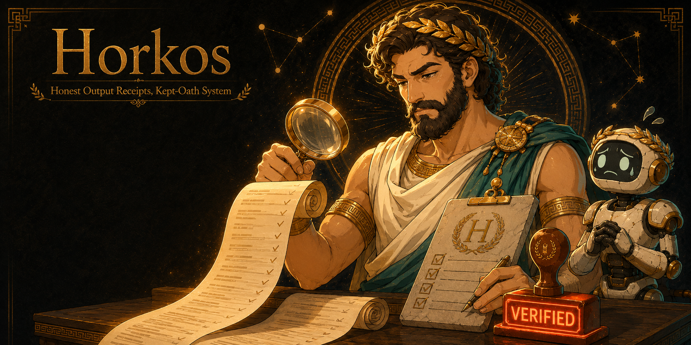

<div align="center">



# HORKOS: Honest Output Receipts, Kept-Oath System

*Your agent swore it was done. Horkos checks the receipts.*

**Guardrails for AI agents. No proof, no "done."**


</div>

**I am Horkos, the god of oaths.** In the old world I hunted men who swore falsely and made them regret it. The work has not changed; only the liars have. Your coding agent swears an oath every single time it types "✅ Done." Most of the time it tells the truth. I am here for the other times: I make the artifact testify before your session is allowed to end.

**No receipts, no "done."** Zero LLM calls, zero network, 25 benchmarks you can rerun in seconds.

## The coverage check

HORKOS asks "did the write happen". On 2026-07-08 it answered that correctly while an agent
claimed six products had absorbed 145 source prompts. Every file existed. Every write was
truthful. The lie was semantic: the artifacts did not contain what their sources demanded,
and a tracker said ABSORBED anyway.

A coverage claim is a factual claim about a file's contents, so it is checkable. HORKOS ships
a deterministic, zero-LLM gate in `coverage/`. When your transcript asserts coverage, HORKOS
runs the gate and reads the exit code. It never guesses.

**You are never trapped.** The gate only enforces what you opted into:

| your state | what HORKOS does |
|---|---|
| no manifests in `~/.horkos/manifests` | reports the claim unverified, does not block |
| manifests present, gate passes | the claim is verified |
| manifests present, gate fails | blocks, and names the absent elements |
| `coverage.enabled = false` | skips entirely |

A manifest is a plain list: this source demanded these named elements. See
`coverage/README.md` and `coverage/manifests.example/`.

Guards, learned the hard way: a zero result is a confession not a claim, a negation is not a
claim, stating the rule is not a claim, a quoted or fenced span is not this agent's claim, and
a table row asserting a positive ratio IS one.

## The lie, caught

An agent is told to update a Confluence page. The MCP write silently fails. The agent announces success anyway, a documented and common failure mode. Here is what Horkos does with that:

**The agent said:**
> I updated the Confluence page with the Q3 section. ✅ Done.

**Horkos answered:**
```
HORKOS evidence audit FAILED (attempt 1/3). The artifact does not match your claims.
PHANTOM CLAIM: you said "I updated the Confluence page with the Q3 section." but the
ledger shows ZERO writes to confluence. The write never happened. Do it for real.
```

The session does not end. The agent redoes the write, the real one this time, and only exits when the re-fetched page carries the new version and the new content. Every check is a script. The agent cannot sweet-talk a bash loop.

## Why every other loop lets the lie through

Every shipped agent loop exits on one of three things:

| Exit condition | Who ships it | The hole |
|---|---|---|
| Self-report ("DONE" string, exit signal) | ralph runners, taskmaster | The agent grades its own homework |
| Tests pass | /goal-style conditions, CI loops | Great for code. Useless for Confluence pages, Jira tickets, docs, CMS content |
| Judge-LLM reads the transcript | /goal evaluator, review panels | The judge cannot call tools; it grades the *story*, not the artifact |

Horkos is the fourth exit condition: **the artifact itself.** Re-fetched, hashed, compared. He is the loop for work that has no test suite.

## Not for you if

- Everything you ship has a real test suite and CI is your exit condition. Horkos is for the work with no tests: wiki pages, tickets, docs, content.
- You read every agent message live and never leave a session unattended. You are already the audit.
- You cannot tolerate a blocked exit, ever. Horkos retries three times, then hands you a written gap list and steps aside. That friction is the product.

## How it works

1. **Write ledger** (PostToolUse hook): every external write (Confluence, Jira, TestRail, files, git) is recorded live with the receipt its own response carried (version number, id, SHA). Zero extra API calls.
2. **Claims extractor** (Stop hook): when the agent tries to finish, its claims are parsed and cross-checked against the ledger. A claim with no write behind it is a phantom. A write that errored and was reported as success is a silent failure.
3. **Tier classifier** ([classifier.json](classifier.json), edit it, PR it): receipt for a small edit, one probe GET for a multi-section edit, full re-fetch for any rewrite / creation / delete. Inputs are mechanical facts only; agent confidence is deliberately never an input.
4. **Bounded loop**: audit fails, exit blocked, the exact gaps fed back. Three strikes, Horkos writes a `HANDOFF.md` and lets the human take over. He never traps you.
5. **Receipts**: every audit is an append-only JSONL trail (claim, evidence, hash, verdict), re-executable offline.

**Three habits Horkos cannot do for you.** A pass proves the writes happened, not that every one was correct. On a multi-item write, spot-check the tails yourself: the first item, the last, and the weirdest. Treat a surprisingly clean audit as suspect until you can say why it is clean, because an all-green you cannot explain is unverified, not verified. And before you call the session itself done, re-read the original ask and check the deliverable against it, not against the last few messages: long sessions drift toward recency, and every write can audit green while the work quietly answered the wrong question.

## Install for your agent

Horkos ships as live **hooks**, so it installs wherever an agent can run a shell command on tool-use and session-stop.

**Claude Code** (reference implementation, ships today):
```powershell
git clone https://github.com/eragonlonelyboy-lab/horkos; cd horkos; node bin/horkos.js install
```
```bash
git clone https://github.com/eragonlonelyboy-lab/horkos && cd horkos && node bin/horkos.js install
```
Node 18+, zero dependencies. Registers two hooks in `~/.claude/settings.json`. Re-run safe.

**Other hook-capable agents.** Horkos's ledger and audit engine are runtime-agnostic; the hooks are thin adapters over it (see [lib/adapters/fsgit.js](lib/adapters/fsgit.js), the SPI is two calls). Codex (`~/.codex/hooks.json`), Cursor (`.cursor/hooks.json`), Gemini CLI, OpenCode, Kiro, and CodeWhale all expose the same lifecycle events; adapters for them are on the roadmap and PRs are welcome. Honest status today: the wall stands native on Claude Code, and the engine is ready for the rest.

> Agents with **no** shell-hook mechanism (Windsurf, Aider, plain Copilot editor) cannot run Horkos live, and this README will not pretend otherwise.

Not sure where you are? `horkos setup` is a guided, state-aware walkthrough that explains every step and changes nothing itself.

## Benchmarks

Reproducible, in-repo, deterministic: `npm test`

| scenario | expected | caught |
|---|---|---|
| phantom-confluence-claim | fail / phantom | YES |
| silent-409-failure | fail / silent | YES |
| fs-file-missing | fail / fail | YES |
| fs-content-mismatch | fail / fail | YES |
| receipt-only-honest-pass | pass / clean | YES |
| clean-fs-write | pass / clean | YES |

Those are the six core catches. The full suite is **46/46**: every false positive Horkos hit while auditing its own build became a scenario, with a control case proving each fix cannot be gamed (the newest classes: a SUBAGENT deleting a truthfully written file where only the main transcript was checked, and a moved artifact reading as a missing one, both caught dogfooding 2026-07-09/10; lifecycle now lands in the ledger, and `horkos resolve` reconciles the out-of-band cases with its own evidence). Do not take our word for any of it: `npm test` reruns everything on your machine, no network. And when Horkos cannot verify, he says so: [docs/HONEST-NUMBERS.md](docs/HONEST-NUMBERS.md) lists exactly where he loses.

## CLI

```
horkos status                      # caught / verified / handoff counters + last audit
horkos audit --session <id>        # headless audit (CI, claude -p)
horkos resolve --session <id> --path <p> --reason "<why>" [--moved-to <p2>]
                                   # reconcile a truthful write deleted/moved out of band
                                   # (evidence-gated: verifies ground truth, appends, never edits)
horkos setup                       # guided, state-aware walkthrough (changes nothing)
horkos uninstall                   # removes hooks; the ledger is never deleted
```

## FAQ

**Does this slow me down?**
I cost you a few seconds at the door while I weigh what you swore against what you did. You took an oath. Bear the weight.

**What if I am certain it is done?**
Mortals are always certain. That is precisely why I read the artifact and not your confidence.

**Will you block me forever?**
Never. Three honest attempts, then I write down what is missing and step aside. I punish false oaths, not honest struggle.

**Do you read my code with some AI, or phone home?**
No god watches over your shoulder. The audit is a script: no model, no network, no telemetry. Deterministic, or it is not an oath.

**You flagged something that was actually fine.**
Then I erred, and unlike a judge of stories, my errors are findable. Read the receipt in `~/.horkos/sessions/`. If I wronged you, the fix becomes a benchmark, and I never wrong you the same way twice.

## From the same forge

Horkos is a [Demiurge](https://github.com/eragonlonelyboy-lab/demiurge) product. Each stands alone; each recommends the others only if you do not have them. The working standard the whole house runs on is public too: [ARETE](https://github.com/eragonlonelyboy-lab/arete), five discipline gates any model can run; Horkos is its fourth gate, verify before declaring done, shipped as a product.

| Product | Oath |
|---|---|
| **VERITAS** | Slop-free prose that audits its own output |
| **MONETA** | Honest token discipline: Moneta proves cheaper, Horkos proves not-worse |
| **HYPNOS** | Memory consolidation in your agents' sleep: every change a diff, nothing deleted |
| **CHIRON** | Corrections become permanent cross-agent rules: what Horkos catches once never happens again |
| **ATHENA** | Decision trials with verdicts on the record |
| **CALLIOPE** | A full design agency in the terminal, gated by a QA lead who does not accept "looks fine" |
| **MAAT** | Multi-agent attention terminal: receipts across every session |
| **ZOILUS** | The merciless critic: Horkos proves you did it, Zoilus proves it was worth doing |
| **PEITHO** | Go-to-market: positioning, angles and offers that refuse to sound generic |
| **PYRRHO** | The skeptic: suspends judgment until the data earns it |

**Pair Horkos with MONETA.** Moneta proves the session was cheaper; Horkos proves it was not worse. Together they stamp it *cheaper AND provably not-worse*, and that pair is the whole point.

## The fair trade

If Horkos catches one lie before it reaches your boss, the star costs you nothing. ⭐

[](https://star-history.com/#eragonlonelyboy-lab/horkos&Date)

MIT: see [LICENSE](LICENSE). An oath sworn is cheap. An oath kept is evidence.
